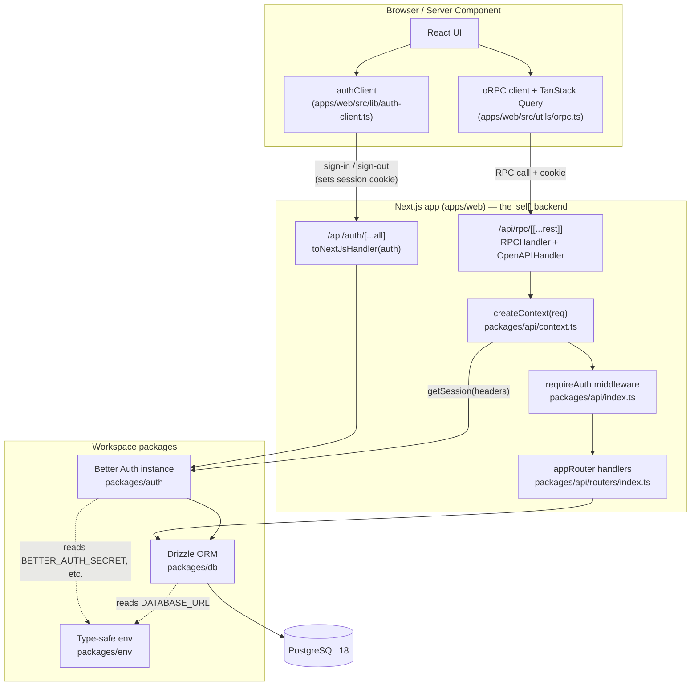
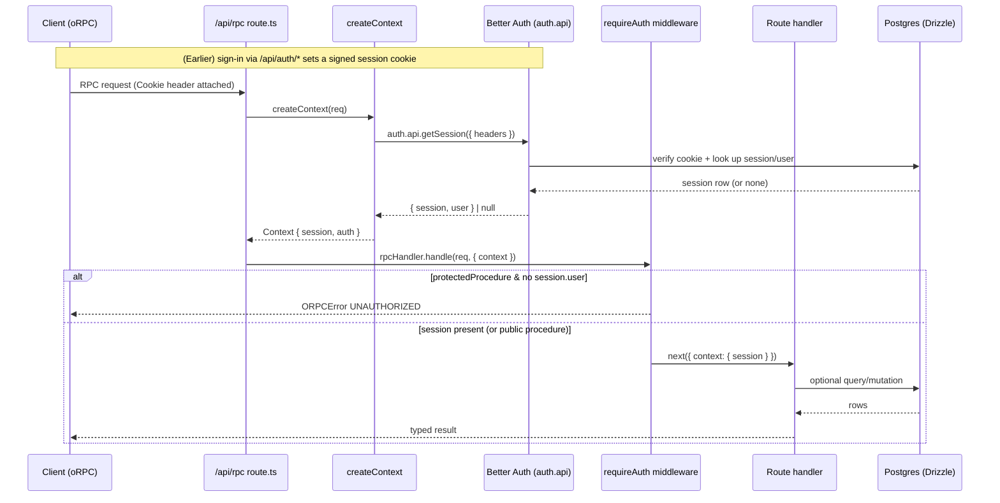

# my-better-t-app

This project was created with [Better-T-Stack](https://github.com/AmanVarshney01/create-better-t-stack), a modern TypeScript stack that combines Next.js, Self, ORPC, and more.

## Features

- **TypeScript** - For type safety and improved developer experience
- **Next.js** - Full-stack React framework
- **TailwindCSS** - Utility-first CSS for rapid UI development
- **Shared UI package** - shadcn/ui primitives live in `packages/ui`
- **oRPC** - End-to-end type-safe APIs with OpenAPI integration
- **Drizzle** - TypeScript-first ORM
- **PostgreSQL** - Database engine
- **Authentication** - Better-Auth
- **Turborepo** - Optimized monorepo build system

## Getting Started

First, install the dependencies:

```bash
pnpm install
```

## Database Setup

This project uses PostgreSQL with Drizzle ORM.

1. Make sure you have a PostgreSQL database set up.
2. Update your `apps/web/.env` file with your PostgreSQL connection details.

3. Apply the schema to your database:

```bash
pnpm run db:push
```

Then, run the development server:

```bash
pnpm run dev
```

Open [http://localhost:3001](http://localhost:3001) in your browser to see the fullstack application.

## Architecture & Data Flow

This is a **single Next.js app** (`apps/web`) backed by workspace packages — there is **no standalone backend server**. The API runs *inside* Next.js route handlers (the "self" backend), and end-to-end type safety flows from the server router type into the client with **no codegen step**.

### Key components

| Package / path | Responsibility |
| --- | --- |
| `apps/web/src/app/api/rpc/[[...rest]]/route.ts` | Single catch-all entry point for the API. Runs the oRPC `RPCHandler`, then falls back to the `OpenAPIHandler` (Scalar UI at `/api/rpc/api-reference`). |
| `apps/web/src/app/api/auth/[...all]/route.ts` | Mounts Better Auth's REST surface (sign-in/up/out, get-session) at `/api/auth/*` via `toNextJsHandler`. |
| `packages/api/src/context.ts` | Builds the per-request `Context` by verifying the session from request headers. |
| `packages/api/src/index.ts` | Defines `publicProcedure` / `protectedProcedure` (the latter via a `requireAuth` middleware). |
| `packages/api/src/routers/index.ts` | The `appRouter`; exports `AppRouter` / `AppRouterClient` types. |
| `packages/auth/src/index.ts` | The Better Auth instance (Drizzle adapter over Postgres, email/password, `nextCookies` plugin). |
| `packages/db` | Drizzle ORM over `node-postgres`; schema in `src/schema/`. |
| `packages/env` | Type-safe env validation (`@t3-oss/env`). |
| `apps/web/src/utils/orpc.ts` | Isomorphic, type-safe client built from `AppRouterClient` + TanStack Query. |

### High-level architecture



### Authenticated request lifecycle

The only thing that crosses between the auth path and the API path is the **signed session cookie**: Better Auth issues it during sign-in; `createContext` later pulls it back out of the request headers and turns it into `context.session`.



### Notes

- **Type safety, no codegen:** `appRouter`'s type (`AppRouter` / `AppRouterClient`) flows directly into the web client. Add an endpoint by adding a procedure to `appRouter` in `packages/api/src/routers/index.ts`.
- **Input validation:** procedures validate input via an `.input(zodSchema)` link placed between the procedure and `.handler` (Zod v4, imported through `@orpc/zod/zod4`). The validated value arrives as `input` in the handler.
- **Session lookups hit the DB on every request** in this scaffold (no caching). Session caching, if added, belongs in the `betterAuth({...})` config in `packages/auth/src/index.ts` (cookie cache needs no new deps; a shared `secondaryStorage`/Redis cache does).
- **Single source of DB config:** `drizzle.config.ts` reads env from `apps/web/.env`, so the web app's `.env` configures both the app and Drizzle tooling.

### Adding an endpoint

Endpoints are procedures on `appRouter` in `packages/api/src/routers/index.ts`. There is no codegen or registration step — adding a procedure makes it instantly available and type-safe on the client.

**Public, no input:**

```ts
healthCheck: publicProcedure.handler(() => {
  return "OK";
}),
```

**Public, with validated input** (Zod v4 via `@orpc/zod/zod4`). The `.input(schema)` link sits between the procedure and `.handler`; the parsed, typed value arrives as `input`:

```ts
import { z } from "zod";

greet: publicProcedure
  .input(z.object({ name: z.string().min(1) }))
  .handler(({ input }) => {
    //          ^ typed { name: string }, already validated
    return `Hello ${input.name}`;
  }),
```

**Protected, with input and a DB write.** `protectedProcedure` runs the `requireAuth` middleware, so `context.session.user` is guaranteed present (otherwise the request throws `UNAUTHORIZED` before the handler runs):

```ts
import { z } from "zod";
import { db } from "@my-better-t-app/db";
import { todo } from "@my-better-t-app/db/schema";

createTodo: protectedProcedure
  .input(z.object({ text: z.string().min(1) }))
  .handler(async ({ input, context }) => {
    const [row] = await db
      .insert(todo)
      .values({ text: input.text, userId: context.session.user.id })
      .returning();
    return row;
  }),
```

Then call it from the client (`apps/web/src/utils/orpc.ts`) with full type inference — e.g. `client.createTodo({ text })`, or through the TanStack Query helpers. If you added a new table, run `pnpm run db:push` to sync the schema first.

## UI Customization

React web apps in this stack share shadcn/ui primitives through `packages/ui`.

- Change design tokens and global styles in `packages/ui/src/styles/globals.css`
- Update shared primitives in `packages/ui/src/components/*`
- Adjust shadcn aliases or style config in `packages/ui/components.json` and `apps/web/components.json`

### Add more shared components

Run this from the project root to add more primitives to the shared UI package:

```bash
npx shadcn@latest add accordion dialog popover sheet table -c packages/ui
```

Import shared components like this:

```tsx
import { Button } from "@my-better-t-app/ui/components/button";
```

### Add app-specific blocks

If you want to add app-specific blocks instead of shared primitives, run the shadcn CLI from `apps/web`.

## Project Structure

```
my-better-t-app/
├── apps/
│   └── web/         # Fullstack application (Next.js)
├── packages/
│   ├── ui/          # Shared shadcn/ui components and styles
│   ├── api/         # API layer / business logic
│   ├── auth/        # Authentication configuration & logic
│   └── db/          # Database schema & queries
```

## Available Scripts

- `pnpm run dev`: Start all applications in development mode
- `pnpm run build`: Build all applications
- `pnpm run dev:web`: Start only the web application
- `pnpm run check-types`: Check TypeScript types across all apps
- `pnpm run db:push`: Push schema changes to database
- `pnpm run db:generate`: Generate database client/types
- `pnpm run db:migrate`: Run database migrations
- `pnpm run db:studio`: Open database studio UI
